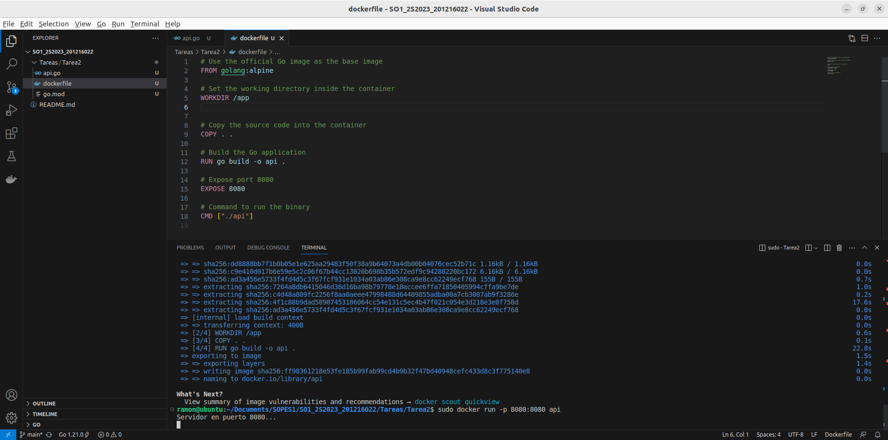
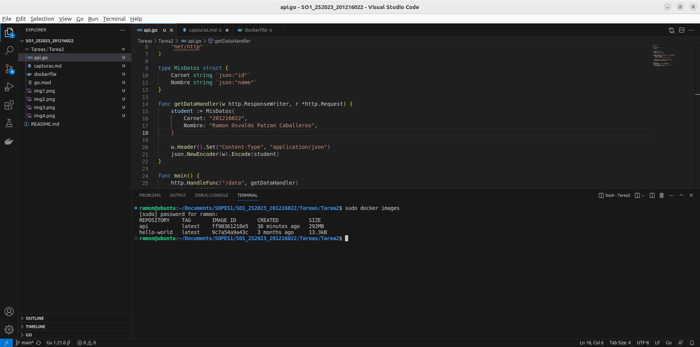
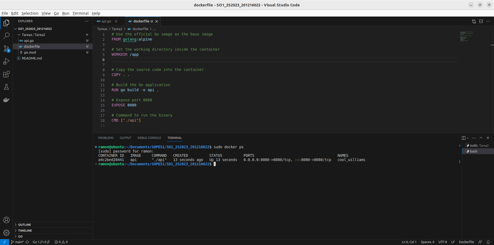
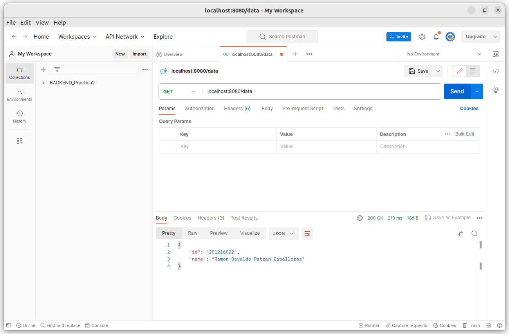

# Tarea 2: Creación de API y Dockerización

**Carnet:** 201216022
**Nombre:** Ramon Osvaldo Patzan Caballeros

## Comandos docker build y docker run

*Figura 1: API en ejecución expuesta en el puerto 8080".*

## Comando docker images

*Figura 2: Listado de imágenes.*

## Contenedor corriendo

*Figura 3: Contenedor Docker corriendo la API. *

## Resultados en POSTMAN

*Figura 4: Acceso desde postman*